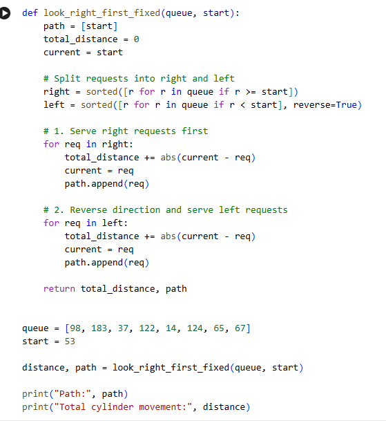
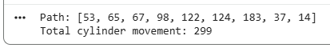

<div align="center">

# 💽 LOOK Disk Scheduling Simulator

### LOOK Disk Scheduling Algorithm Implementation in Python

[](https://www.python.org/)
[](LICENSE)
[](https://colab.research.google.com/)

<br>

A Python implementation of the **LOOK Disk Scheduling Algorithm** with seek path generation and total cylinder movement calculation.

</div>

---

## 📌 Overview

This project demonstrates the implementation of the **LOOK (Look Ahead) Disk Scheduling Algorithm**, a commonly used disk scheduling technique in Operating Systems.

Unlike the SCAN algorithm, LOOK does not move the disk head all the way to the disk boundary. Instead, it moves only as far as the last pending request in the current direction before reversing.

In this implementation, the disk head moves **right first**, services all requests on the right side, then reverses direction and services the remaining requests on the left side.

The simulator calculates:

* Disk head movement path
* Seek sequence
* Total cylinder movement
* Final servicing order

The project was developed and tested using **Google Colaboratory (Google Colab)**.

---

## ✨ Features

* LOOK Disk Scheduling Simulation
* Right-First Head Movement Strategy
* Seek Path Generation
* Total Cylinder Movement Calculation
* Efficient Disk Head Traversal
* Google Colab Notebook Included
* Python Source Code Included

---

## 🧠 About LOOK Disk Scheduling

LOOK is an improved version of the SCAN Disk Scheduling Algorithm.

Instead of moving the disk head to the extreme end of the disk, LOOK only travels up to the last request in the current direction and then reverses.

### Advantages

* Less head movement than SCAN
* Improved seek performance
* Reduced unnecessary traversal
* Efficient request servicing

### Limitations

* Requires sorting of requests
* Performance depends on request distribution
* Requests in the opposite direction may experience longer waits

---

## ⚙️ Algorithm

1. Start from the current disk head position.
2. Divide requests into:

   * Right-side requests
   * Left-side requests
3. Sort right-side requests in ascending order.
4. Sort left-side requests in descending order.
5. Service all right-side requests first.
6. Reverse direction.
7. Service all left-side requests.
8. Calculate total cylinder movement.
9. Return the final seek path.

---

## 🧮 Input Example

```python
queue = [98, 183, 37, 122, 14, 124, 65, 67]
start = 53
```

---

## 📊 Output Example

```text
Path: [53, 65, 67, 98, 122, 124, 183, 37, 14]

Total cylinder movement: 299
```

---

## 📈 Seek Path Representation

```text
53 → 65 → 67 → 98 → 122 → 124 → 183 → 37 → 14
```

---

## 📋 Movement Analysis

| From | To  | Distance |
| ---- | --- | -------- |
| 53   | 65  | 12       |
| 65   | 67  | 2        |
| 67   | 98  | 31       |
| 98   | 122 | 24       |
| 122  | 124 | 2        |
| 124  | 183 | 59       |
| 183  | 37  | 146      |
| 37   | 14  | 23       |

### Total Cylinder Movement

```text
12 + 2 + 31 + 24 + 2 + 59 + 146 + 23

= 299
```

---

## 📸 Google Colab Workspace



---

## 📸 Program Output



---

## 📂 Project Structure

```text
LOOK-Disk-Scheduling-Simulator/
│
├── LOOK_Disk_Scheduling.ipynb
├── look.py
├── README.md
├── LICENSE
├── .gitignore
│
└── screenshots/
    ├── colab-workspace.png
    └── output.png
```

---

## 🚀 How to Run

### Clone the Repository

```bash
git clone https://github.com/tausif112/LOOK-Disk-Scheduling-Simulator.git
```

### Navigate to the Project Directory

```bash
cd LOOK-Disk-Scheduling-Simulator
```

### Run the Program

```bash
python look.py
```

---

## 🛠 Technologies Used

| Technology        | Purpose                  |
| ----------------- | ------------------------ |
| Python            | Core Implementation      |
| Google Colab      | Development Environment  |
| GitHub            | Version Control          |
| Operating Systems | Disk Scheduling Concepts |

---

## 🔮 Future Improvements

* C-LOOK Disk Scheduling Implementation
* SCAN Disk Scheduling Comparison
* C-SCAN Disk Scheduling Comparison
* SSTF Disk Scheduling Comparison
* Graphical Seek Path Visualization
* Interactive User Input
* Dynamic Disk Request Input
* Comparison Between Disk Scheduling Algorithms

---

# 📄 License

This project is licensed under the MIT License.

See the LICENSE file for details.

---

# 👨‍💻 Author

**Md. Tausif Uddin**
B.Sc. in Computer Science and Engineering (CSE)
University of Asia Pacific (UAP)

GitHub: https://github.com/tausif112

---

<div align="center">

⭐ If you found this project useful, consider giving it a star!

</div>
